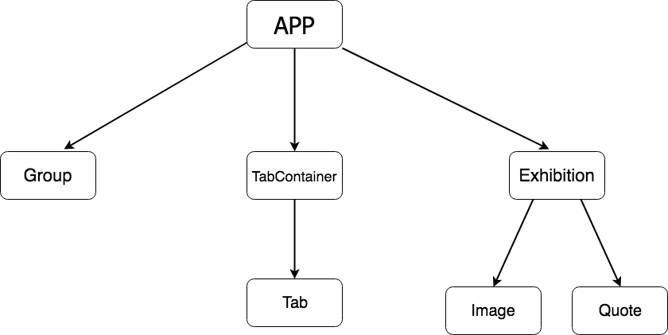

# IT2810 Webutvikling Prosjekt 2

## Dokumentasjon - Gruppe 34

I denne dokumentasjonen skal vi diskutere og begrunne de viktigste valgene vi har gjort og
løsningene vi har valgt for å tilfredsstille kravene i dette prosjektet.

### Krav til innhold og funksjonalitet

Første steg i utviklingen av denne websiden var det å se for oss et passende design.
Vi tok utgangspunkt i layout-utkastet da vi syntes dette var et veldig intuitivt design der man ikke har noe skjult funksjonalitet.
Brukervennligheten (åpenbart sammen med kravene) vurderte vi også når vi skulle designe layout og funksjonalitet.

Blant annet tenkte vi at brukeren forventer en respons i det øyeblikket man interagerer med kategorivalgene. Derfor gjorde vi det så
intuitivt som mulig ved at man får lastet inn den valgte kategorien umiddelbart når man trykker.

### Filorganisering

Vi har oppfylt minimumskravet til antall filer, med 12 av hver filtype i 3 forskjellige kategorier.

_ContentFiles --> Pictures/Quotes/Sounds --> 12 av hver type fil_

_(Dette gjelder bilder og tekst)_

Alle filene er lagret i en mappe kalt "ContentFiles". I denne mappen er de ulike filtypene fordelt i hver sin undermappe.
Vi vurderte lenge å ha enda 3 undermapper her, for hver kategori. Men vi endte opp med å droppe dette for lyd og bilde ettersom vi allerede har
kategorisert filene via filnavnet. Når det gjelder lyd var det litt mer komplisert å kategorisere hver enkelt lydfil, så vi endte der opp
med å lage tre undermapper. Alt i alt ble generering av URL'ene ganske enkelt uansett.

### React og komponentstruktur

Vi brukte en del tid på å strukturere de ulike delene av websiden vår i ulike komponenter.
Komponentstrukturen vi endte opp med er som vist i bildet nedenfor (komponentene er forklart enkeltvis under bildet):

#### App

App er hovedkomponenten vår, som inneholder alle andre komponenter.
Når man lager en single page application er det vanlig praksis å ha en hovedkomponent som inneholder
hele siden. Vi har også valgt å ha alle funksjoner som håndterer tilstand i App komponenten. Dette litt på grunn av at vi tenkte å ikke
gjøre ting mer komplisert enn de allerede er, og at det ikke var mye tilstand som var relevant for andre komponenter.
En tanke var å håndtere tilstanden til hvilke utstillingelementer som ble vist i Exhibition-komponenten, men vi vurderte det som
unødvendig i denne situasjonen.

#### Group

Vi valgte å lage radio buttons ved at vi har 3 Group-komponenter og har 3 radiobuttons i hver group.
Dette på grunn av at 3 og 3 radio buttons er avhengige av hverandre og at dette da ble en intuitiv måte å gjøre det på.

#### TabContainer

Dette er komponenten som inneholder Tab-funksjonaliteten vår. Hovedsaklig så genererer denne komponenten 4 Tab-komponenter.
Vi kunne klart oss uten Tab-komponenten og heller kodet tab'ene i TabContainer, men vi tenkte at det var en fordel å gjøre det mer
dynamisk ved å generere underkomponenter ettersom det også var mer oversiktlig.

- #####Tab
  Her rendres bare en div som er vår knapp for den bestemte tab'en. Vi har her også en funksjon som
  håndterer hvilken tab som er aktiv for øyeblikket.

#### Exhibition

Dette er komponenten som inneholder utstillingsobjektene våre. Underkomponentene til Exhibiton er Image og Quote. Vi har ikke
med lyd som en underkomponent her på grunn av måten lyd er implementert. Det fungerte bedre å ha lyden kodet direkte i App, og ettersom
det ikke var noen spesielle krav til hvordan lyd var implementert gjorde vi det på denne måten.
Så Exhibition-komponenten vår samler egentlig bare de ulike kompoentene for media.

- #####Image
  Veldig enkel komponent som inneholder en div der SVG-elementet blir satt inn basert på tilstanden til App.

- #####Quote
  På samme måte som Image er dette også en veldig enkel komponent der teksten blir satt inn i en paragraf basert på
  tilstanden til App.

### AJAX (Asynchronous JavaScript And XML)

Slik som spesifisert i kravene måtte man bruke AJAX-kall for å hente bilder (SVG-filer) og
tekst (JSON-filer). For å få til AJAX-kall valgte vi å bruke Fetch API'et. Dette API'et var
lett å sette seg inn i, og minimalt med kode var nødvendig for å gjøre kall. Med metoder fra Fetch API'et oppnår man det
generelt det samme som med en XMLHttpRequest, men dette uten like kompleks kode. Det kan også nevnes at fetch() ikke stopper websiden
selv om responsen skulle være for eksempel HTTP 404.

Et av kravene sier også at man kun skal gjøre et AJAX-kall én gang, slik at man aldri laster noe unødvendig.
For å fikse dette kravet har vi brukt sessionstorage egenskapen. Vi lagret bilder og tekst når de blir lastet inn første gang,
slik at påfølgende kall til samme element returnerer det lagrede objektet.

Lasting av lyd har vi ikke implementert på noen spesiell måte, ettersom dette ikke var et krav.
Vi har brukt audio-taggen i HTML5 og gjort det slik at filen som spilles av er basert på gjeldende valg
av lydkategori.

### Responsive Web Design

Vi har sørget for at alle kravene til responsiveness er oppfylt. Dette har vi kodet fra bunnen av i CSS,
med alle elementene nevnt i kravene (viewport, media-queries, bilder som skalerer og flytende layout). Litt om de
forskjellige elementene:

- Viewport gjør at siden tilpasser seg skjermen den vises på.
- Media-queries gjør at vi kan endre CSS-koden for forskjellig orientasjon og størrelse på skjermen.
- Bilder som skalerer fikset vi ved at bildet følger størrelsen til container-div'en sin, og container-div'en
  endrer seg basert på skjermstørrelsen.
- Flytende og fleksibel layout er sørget for ved alle kravene ovenfor.

Vi valgte også å designe siden for mobil først, ettersom det er vanskeligere å sørge for brukervennlighet på mobil enn
på en større skjerm. Vi har noen utfordringer med orientation på mobil, som ble oppdaget i testfasen. Mer om dette
i testdokumentet.

### Github

På github har vi passet på å bruker branches og issues effektivt for å holde prosjektet strukturert.
Vi har laget issues både i starten og underveis i prosjektet ettersom vi ser nye utfordringer som må løses.
Der det har vært relevant har vi også knyttet commits opp mot issues, igjen for å ha oversikt over hva som er gjort
og hvorfor.

##### Branches

Master branchen ble lite brukt, ettersom vi heller lagde en "dev" branch der all fungerende implementasjon skulle ligge.
Master branchen skulle heller brukes til det ferdige prosjektet. Ellers gjorde vi det sånn at alle nye funkjsoner skulle
implementeres i en egen branch og merges med "dev" når testing av funksjonaliteten var gjort.
Måten vi håndterte branches på gjorde at vi hele tiden hadde en relativt bra fungerende versjon av websiden.

### Utførelse av test

Oppgaver:

1. Velg en kombinasjon av bilde, «quote» og lydtype.
2. Naviger gjennom de ulike tab-ene.
3. Spill av lyd.

Da funksjonaliteten på nettsiden ikke er mye, kom vi fram til at det holdt med tre oppgaver for å teste brukergrensesnittet. Vi valgte ut en enhet for hver testperson. En mobil(iPhone), en laptop (m/ stor skjerm) og en mobil(android). Vi ba da testpersonene utføre disse oppgavene på enhetene som ble valgt ut for dem uten at vi ga dem noe hjelp.
Alle testpersonene var enige om at funksjonaliteten på nettsiden fungerte bra, at siden responderte kjapt på trykk og de tok til konseptet ganske fort. På iPhone var det dog et lite problem. Når brukeren roterte mobilen til landscape også tilbake til portrait så ble «checkbox»-div feilplassert og «hang» igjen i landscape modus. Vi mistenker at dette er et overflow og/eller position problem, men vi klarte ikke å løse det innenfor tidsfristen.
